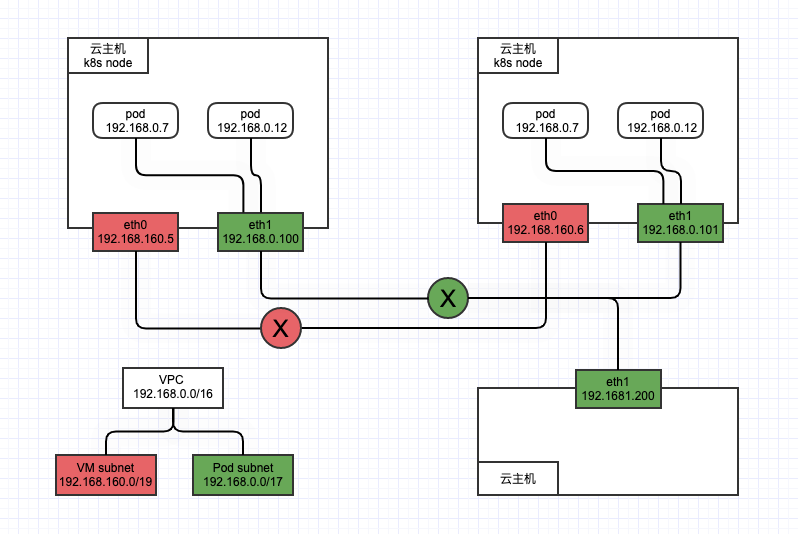
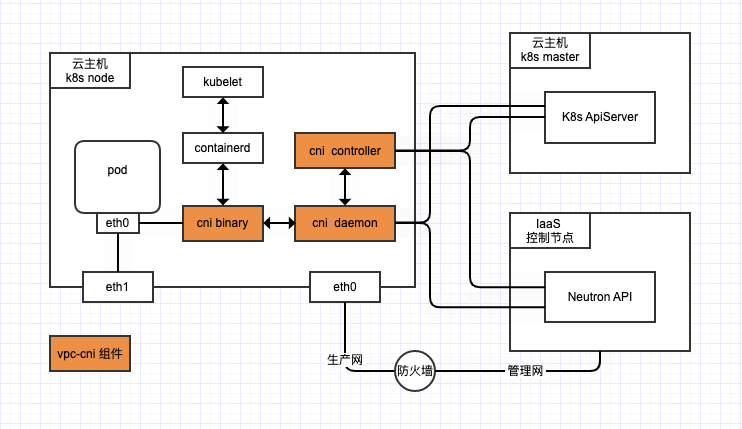

## 0. what && why vpc-cni

参照: [vpc-cni 调研](https://github.com/chestack/k8s-blog/blob/master/network/vpc-cni.md)

## VPC-CNI功能描述

vpc-cni是一种kubernetes CNI网络插件，为部署在Cloud (OpenStack)虚拟机上面的K8s集群提供容器网络插件能力。核心思路是, 将容器网络和容器所在虚拟机的网络做扁平化压缩为一层，对应地解决通用CNI不容易解决的两个问题

- 性能问题, 基于虚拟机部署的K8s集群，虚拟机之间通信一般是隧道模式，通用的CNI插件解决Pod跨节点通信也会有一层基于UDP的隧道封装. 这样Pod跨节点通信会经过两层隧道，单机侧需要做两次封包解包，会带来比较大的性能损耗.
- 网络访问，通用CNI环境 集群外无法直接访问Pod IP，只能访问到Pod所在节点再跳转到Pod。vpc-cni 将IaaS层的subnet、ip池等网络资源直接给Pod使用，同一VPC内k8s集群外的工作负载 可以更方便的访问Pod.

## VPC-CNI实现方案

vpc-cni网络拓扑图



- VPC做整体网络规划，建议分别规划：虚机网络给云主机使用，Pod业务网络给容器使用。
- K8s集群的node节点 额外挂载一张容器业务网卡eth1，云主机内的Pod网络通过Ipvlan模式连接到这张网卡。云主机的eth1和Pod IP地址都在Pod subnet网络里分配，以实现Pod和云主机使用同一层网络的设计目标。

vpc-cni组件间交互图



- cni controller，作为中心控制器，完成ip 资源的协调分配、固定IP预留与占用、network policy资源的监听和解析工作，需要访问k8s API和neutron API。
- cni daemon 作为每个节点的daemonset pod，负责本节点Pod的IP分配与回收工作，需要访问k8s API和 neutron API。
- cni binary 根据cni daemon的返回结果，完成具体的设备创建、ip地址的配置、路由规则配置等功能。

## how to build

- build cni binary plugin rubble : ```GOOS=linux go build cmd/cni/rubble.go ```
- build rubble daemon server: ```GOOS=linux go build cmd/cni-daemon/rubble-daemon.go```

## how to debug

use [cni/cnitool](https://github.com/containernetworking/cni/blob/main/cnitool/README.md) call rubble to simulate as containerd call rubble.

- start cni-server: 
  ```
  env OS_AUTH_URL=http://keystone-api.openstack.svc.cluster.local:80/v3 OS_DOMAIN_NAME=Default OS_PROJECT_NAME=service OS_USER_DOMAIN_NAME=Default OS_USERNAME=drone OS_PASSWORD=IcesNpQI ./rubble-daemon --kube-config=/root/.kube/config
  ```
  

- run cnitool to do cmdAdd:
```
  export CNI_ARGS="IgnoreUnknown=1;K8S_POD_NAMESPACE=default;K8S_POD_NAME=nginx-5cdf8bbdf6-mfngn"
  export CNI_PATH=/opt/cni/bin
  
  ./cnitool add rubble /var/run/netns/testing
  
  tailf /var/log/rubble.cni.log
  ```


